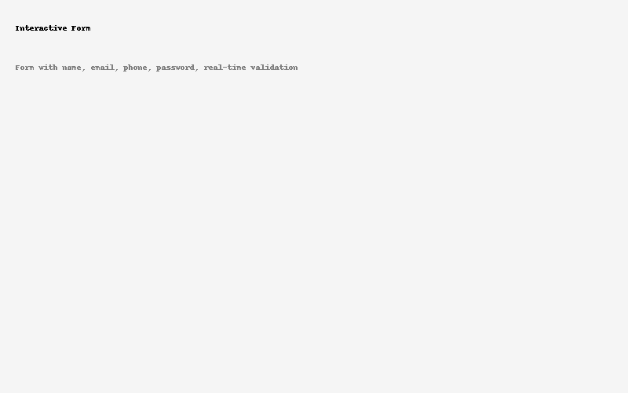

Codveda Internship Front-End Projects

Welcome to my **Front-End Development Internship** submission for **Codveda Technologies**!  
This repository contains three complete tasks that demonstrate my skills in HTML, CSS, JavaScript, and API integration.

---
Project Overview

 1️⃣ [Responsive Landing Page](./responsive-landing-page/)
A modern and fully responsive landing page built with semantic HTML5 and CSS Flexbox/Grid.

- 🌐 Semantic structure
- 📱 Mobile-first responsiveness
- 🎨 Modern layout & animations

> 

---

### 2️⃣ [Interactive Form with Validation](./interactive-form/)
A real-time validated user registration form using vanilla JavaScript.

- ✔️ Name, Email, Phone, and Password validation
- 🔐 Password strength check
- ⚡ Instant error feedback

> 

---

 3️⃣ [GitHub REST API Integration](./rest-api-app/)
A single-page app that fetches and displays GitHub user data using Fetch API.

- 🔍 Debounced search input
- 🧑‍💻 Dynamic user data
- 🛠️ Error handling & loading state

> 

---

 How to Run Locally

1. Clone the repository:
   ```bash
   git clone https://github.com/PriyankaMondal9/codveda-internship-projects.git


